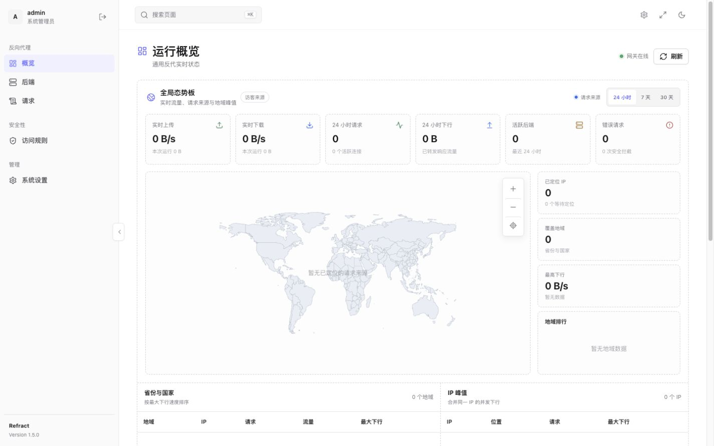

# Refract

[](https://github.com/T-Matrix/Refract/actions/workflows/ci.yml)
[](https://github.com/T-Matrix/Refract/releases)
[](LICENSE)
[](go.mod)

Refract 是运行在 VPS 上的通用 URL 反向代理与 Emby/Jellyfin 流媒体网关。它将完整原始地址放在代理域名之后，并自动处理重定向、HLS、Range、WebSocket 和多后端推流。

```text
https://proxy.example.com/https://origin.example.com/path?x=1
https://proxy.example.com/http://origin.example.com:8096/path
```

它同时提供完整的中文管理面板，用于实时流量、连接、地域、访问规则、通知、审计和备份管理。



## 核心能力

- 通用 HTTP/HTTPS 代理，保留任意方法、请求体和原始查询参数顺序。
- WebSocket、Range / If-Range 和流式响应透传。
- 自动改写 `Location`、`Content-Location`、`Refresh`、Emby JSON 和 HLS 播放列表 URL。
- 自动发现的推流域名由服务端签名，无需逐个手工添加 CDN 域名。
- DNS 固定与 SSRF 防护，默认阻止私网、回环、链路本地和保留地址。
- 每秒实时上传/下载、当前连接、后端排行和脱敏请求日志。
- 可缩放世界请求地图：中国大陆精确到省份，其他地区按国家聚合。
- 按客户端 IP 聚合并发下载，记录实际每秒峰值速度。
- 24 小时、7 天、30 天、90 天统计与 CSV 导出。
- 可关闭的域名黑名单 / 白名单模式，规则只匹配域名及子域名。
- Telegram 日报、Cloudflare Turnstile、管理审计与 SQLite 备份恢复。
- Docker Compose + Caddy 自动申请和续期 HTTPS 证书。

## 一键部署

### 准备条件

- Linux VPS，支持 `amd64` 或 `arm64`。
- 一个已经解析到 VPS 公网 IP 的域名。
- 防火墙放行 TCP 80、TCP 443；启用 HTTP/3 时同时放行 UDP 443。
- 使用 root，或能够执行 `sudo` 的账号。

脚本支持 Debian、Ubuntu、RHEL、CentOS、Fedora 和 Alpine。缺少 Docker 时会通过 Docker 官方安装脚本安装 Engine 与 Compose 插件。

先查看脚本，再执行：

```bash
curl -fsSL https://raw.githubusercontent.com/T-Matrix/Refract/main/scripts/install.sh -o install-refract.sh
less install-refract.sh
sudo sh install-refract.sh
```

脚本会询问域名和默认上游，自动生成 256 位签名密钥与管理会话密钥，启动服务并等待健康检查通过。首次部署完成后访问：

```text
https://你的域名/setup
```

在安装页面创建管理员账号和密码，之后通过 `/login` 进入后台。

### 非交互部署

安全模式只允许配置的初始后端，自动发现的推流后端仍会通过签名放行：

```bash
curl -fsSL https://raw.githubusercontent.com/T-Matrix/Refract/main/scripts/install.sh \
  | sudo sh -s -- \
      --domain proxy.example.com \
      --upstream https://emby.example.com \
      --yes
```

多个初始后端：

```bash
curl -fsSL https://raw.githubusercontent.com/T-Matrix/Refract/main/scripts/install.sh \
  | sudo sh -s -- \
      --domain proxy.example.com \
      --allow-hosts 'emby1.example.com,emby2.example.com,*.trusted.example.com' \
      --yes
```

允许任何用户代理任意公网目标：

```bash
curl -fsSL https://raw.githubusercontent.com/T-Matrix/Refract/main/scripts/install.sh \
  | sudo sh -s -- \
      --domain proxy.example.com \
      --public-proxy \
      --yes
```

> [!WARNING]
> `--public-proxy` 会把服务变成公开的公网 HTTP 代理，可能被用于盗链、扫描或消耗带宽。私网目标仍然默认禁止，但公网部署应结合面板黑名单、并发限制和上游防火墙持续观察。

### 一键更新

默认安装目录 `/opt/refract`：

```bash
curl -fsSL https://raw.githubusercontent.com/T-Matrix/Refract/main/scripts/install.sh | sudo sh
```

自定义安装目录：

```bash
curl -fsSL https://raw.githubusercontent.com/T-Matrix/Refract/main/scripts/install.sh | sudo sh -s -- --install-dir /你的安装目录
```

脚本会执行快进更新并重建容器，现有 `.env`、SQLite 数据、面板账号和证书都会保留。
旧版 `/opt/vps-url-gateway` systemd 部署也会被自动识别，脚本将校验最新 Release、备份当前二进制并原地更新；健康检查失败时自动回滚。

## 手动部署

需要 Docker Engine 与 Docker Compose v2：

```bash
git clone https://github.com/T-Matrix/Refract.git
cd Refract
cp .env.example .env
openssl rand -hex 32
```

编辑 `.env`，至少配置：

```dotenv
PROXY_DOMAIN=proxy.example.com
DEFAULT_UPSTREAM=https://emby.example.com
ALLOWED_UPSTREAMS=emby.example.com
SIGNING_SECRET=至少32字符的随机值
ADMIN_ENABLED=true
ADMIN_USERNAME=admin
ADMIN_SESSION_SECRET=至少32字符的另一个随机值
```

`ADMIN_PASSWORD_HASH` 留空时，首次访问 `/setup` 创建管理员。然后启动：

```bash
docker compose up -d --build
docker compose ps
curl https://proxy.example.com/_gateway/health
```

## 使用方式

配置了默认上游后，Emby/Jellyfin 客户端可以直接填写：

```text
https://proxy.example.com
```

完整 URL 模式：

```text
https://proxy.example.com/https://emby.example.com
https://proxy.example.com/http://emby.example.com:8096
```

当上游返回新的 CDN 推流地址时，Refract 会把它改写成带短期 HMAC 签名的代理地址：

```text
原始：https://stream-cdn.example.net/video/master.m3u8?token=abc
改写：https://proxy.example.com/https://stream-cdn.example.net/video/master.m3u8?token=abc&__vug_exp=...&__vug_sig=...
```

签名链接不需要加入初始上游列表，但仍会经过 DNS 和私网地址检查。

## 管理面板

| 页面 | 用途 |
| --- | --- |
| 运行概览 | 实时速率、周期流量、请求地图、区域排行与系统状态 |
| 主要后端 | 后端流量、请求、错误、最近活动及快捷屏蔽/放行 |
| 实时连接 | 当前客户端、目标、路径、位置、速率、流量与断开操作 |
| 统计报表 | 24 小时至 90 天趋势、后端、客户端和地域 CSV |
| 访问规则 | 关闭、黑名单、白名单三种域名策略 |
| 审计日志 | 登录、规则、通知、连接和备份操作记录 |
| 备份恢复 | 一致性快照、导入、下载、恢复与自动保留策略 |
| 系统设置 | Telegram 日报、Turnstile、账号与运行配置 |

访问规则只比较目标域名，与 URL 路径无关。`example.com` 会匹配自身和 `media.example.com`，不会误匹配 `badexample.com`：

- **关闭**：保存的名单不参与判断，所有符合初始目标和安全策略的域名放行。
- **黑名单**：名单内域名拒绝，其他域名放行。
- **白名单**：只有名单内域名放行，其他域名拒绝。

私网、回环和保留地址防护独立于上述模式，始终生效，除非显式设置 `ALLOW_PRIVATE_TARGETS=true`。

## 主要配置

| 变量 | 默认值 | 说明 |
| --- | --- | --- |
| `PROXY_DOMAIN` | 必填 | 已解析到 VPS 的公网域名 |
| `DEFAULT_UPSTREAM` | 空 | 客户端不携带完整 URL 时使用的默认上游 |
| `ALLOWED_UPSTREAMS` | 空 | 允许直接访问的初始目标，逗号分隔，支持 `*.example.com` |
| `SIGNING_SECRET` | 必填 | 至少 32 字符，用于动态推流 URL 签名 |
| `SIGNED_URL_TTL` | `24h` | 动态签名链接有效期 |
| `ALLOW_UNSIGNED_TARGETS` | `false` | 允许任意公网目标，即通用开放模式 |
| `ALLOW_PRIVATE_TARGETS` | `false` | 允许私网、回环或保留地址目标 |
| `PASS_CLIENT_IP` | `false` | 是否向上游传递客户端真实 IP |
| `ADMIN_ENABLED` | `false` | 启用管理面板和统计持久化 |
| `ADMIN_SESSION_TTL` | `12h` | 管理会话有效期 |
| `GEOIP_LOOKUP_URL` | `ipwho.is` | 必须是含 `{ip}` 的 HTTPS 查询地址，留空关闭定位 |
| `MAX_CONCURRENT_REQUESTS` | `64` | 全局并发请求限制 |
| `MAX_CONCURRENT_PER_IP` | `12` | 单客户端 IP 并发限制 |

完整配置和注释参见 [.env.example](.env.example)。Turnstile 与 Telegram 密钥由面板保存，不写入环境变量；服务端使用从管理会话密钥派生的 AES-256-GCM 密钥加密。

## 日常运维

默认安装目录为 `/opt/refract`：

```bash
cd /opt/refract
docker compose ps
docker compose logs -f gateway caddy
docker compose restart
docker compose pull
docker compose up -d --build
```

停止服务但保留数据：

```bash
docker compose down
```

不要在需要保留统计和配置时执行 `docker compose down -v`，它会删除数据库与证书数据卷。

## 接入现有反向代理

Refract 自身监听 HTTP `:8080`。不使用自带 Caddy 时，入口代理必须保留 `/https://` 中的双斜杠，并正确透传 WebSocket。Nginx 示例：

```nginx
map $http_upgrade $connection_upgrade {
    default upgrade;
    ''      close;
}

server {
    merge_slashes off;

    location / {
        proxy_pass http://127.0.0.1:8080;
        proxy_http_version 1.1;
        proxy_set_header Host $http_host;
        proxy_set_header X-Forwarded-Proto $scheme;
        proxy_set_header X-Forwarded-Host $http_host;
        proxy_set_header Upgrade $http_upgrade;
        proxy_set_header Connection $connection_upgrade;
        proxy_buffering off;
        proxy_request_buffering off;
    }
}
```

同时设置：

```dotenv
PUBLIC_BASE_URL=https://proxy.example.com
TRUST_PROXY_HEADERS=true
```

## 安全模型

- 安全模式下，未签名初始 URL 必须匹配 `DEFAULT_UPSTREAM` 或 `ALLOWED_UPSTREAMS`。
- 自动发现的 CDN URL 必须携带服务端 HMAC 签名，并受有效期限制。
- 目标域名解析结果固定，连接前后都检查私网、回环和保留地址。
- 默认不向上游传递客户端真实 IP，并移除常见代理与 Cloudflare 特征头。
- 管理会话使用 `HttpOnly`、`Secure`、`SameSite=Strict` Cookie，写操作验证同源。
- 日志不保存查询参数、Cookie、请求头或请求体，常见敏感字段会脱敏。
- Turnstile 必须先通过配置自测才能启用，验证失败时默认拒绝登录。

漏洞报告方式参见 [SECURITY.md](SECURITY.md)。

## 已知边界

- Refract 不扫描或改写任意 HTML、CSS、JavaScript，因此不是完整网页镜像器。
- JSON 只改写完整 URL 字符串和常见媒体路径字段。
- 默认最多读取 8 MiB JSON/HLS 响应用于改写，更大响应保持流式原样转发。
- 多个上游使用相同 Cookie 名时可能互相覆盖。
- 使用外部 HTTP/SOCKS 出口代理时，最终 DNS 解析可能由出口代理执行，还需在出口侧限制目标。
- IPPure 的公开 MyIP 接口只能返回调用方出口 IP，不能查询指定访客，因此默认使用支持 `{ip}` 的 `ipwho.is`。

## 开发与测试

```bash
go test ./...
go vet ./...
sh -n scripts/install.sh
docker build -t refract:dev .
```

GitHub Actions 会在每次提交时执行测试、静态检查和容器构建。推送 `v*` 标签后，Release 工作流会自动交叉编译 Linux `amd64` / `arm64` 二进制，生成 `SHA256SUMS.txt`、完整发布包并发布到 GitHub Releases；也可以在 Actions 页面手动运行工作流，只生成临时构建产物。

贡献规范参见 [CONTRIBUTING.md](CONTRIBUTING.md)，版本变化参见 [CHANGELOG.md](CHANGELOG.md)。

## 许可证与致谢

Refract 源码使用 [MIT License](LICENSE)。内置的 Lucide、Apache ECharts、OpenFlare 地图数据及其他来源说明见 [THIRD_PARTY_NOTICES.md](THIRD_PARTY_NOTICES.md) 和 [Apache License 2.0](LICENSE-APACHE-2.0)。
